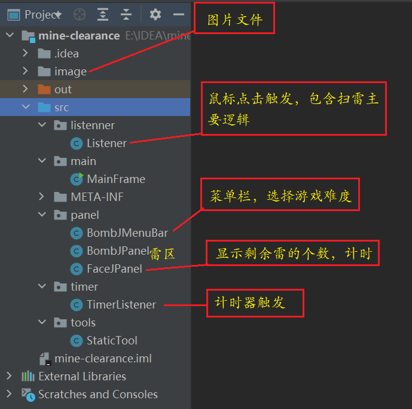
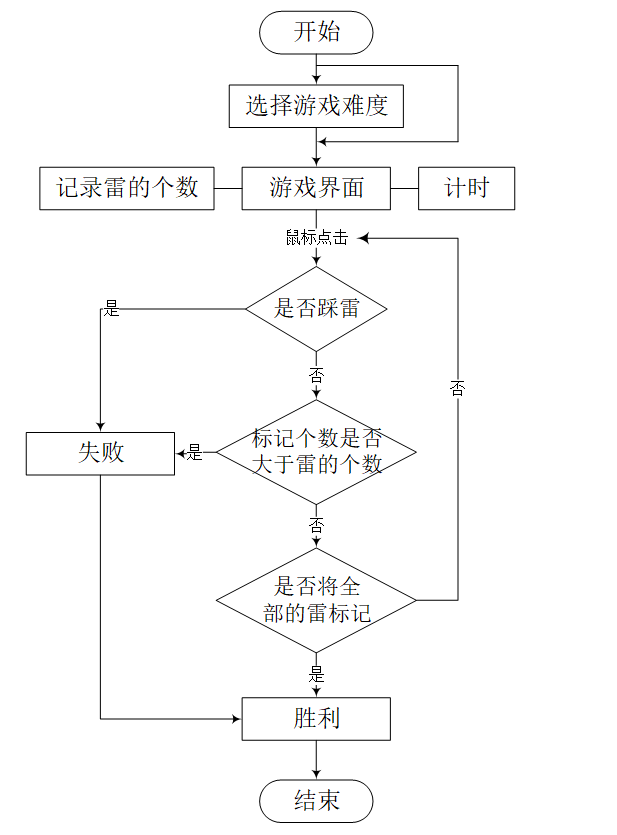
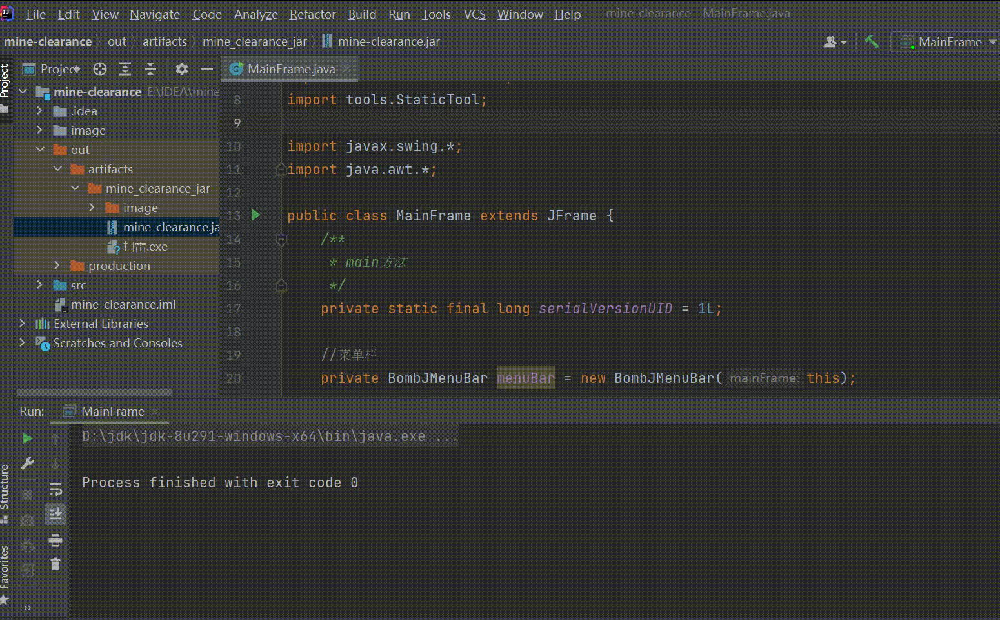
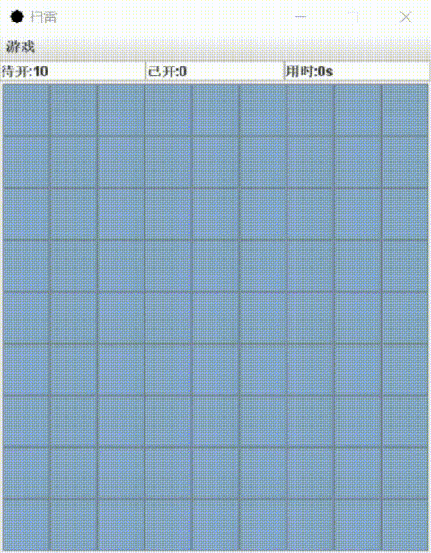
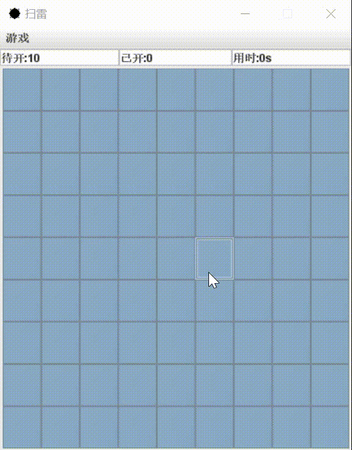
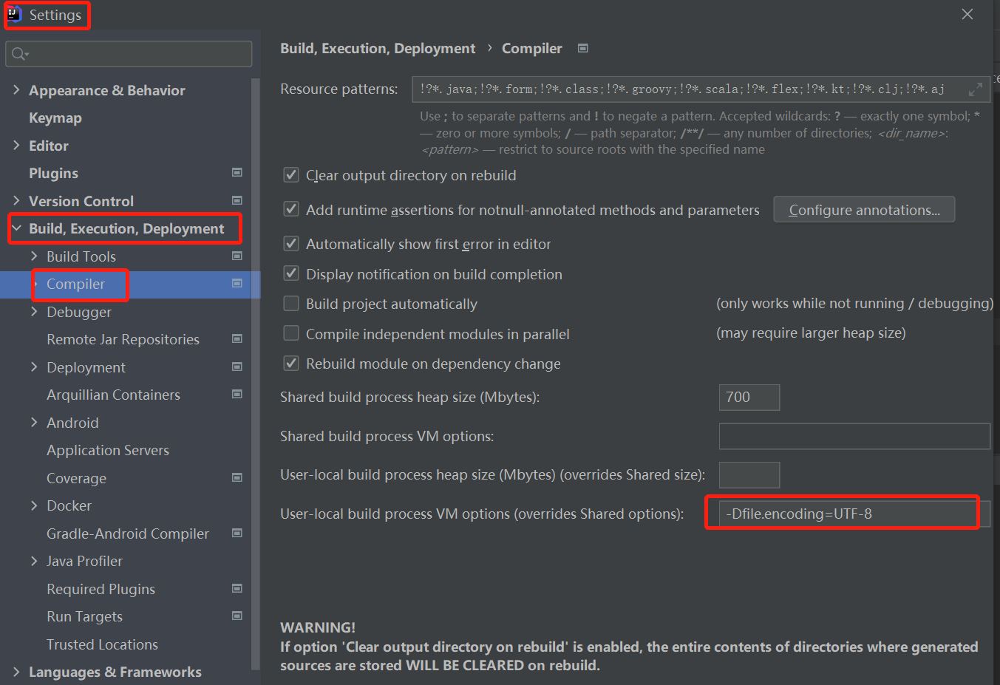
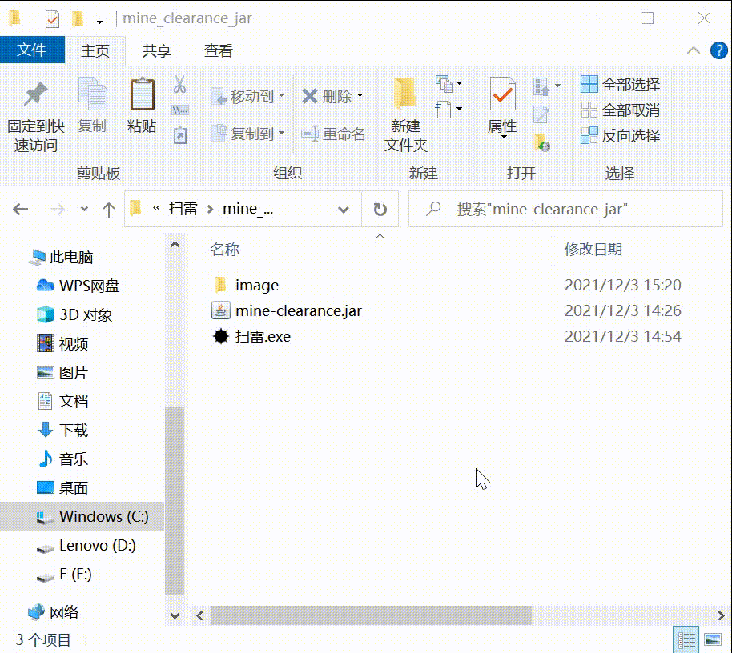

# 1、项目简介

* 采用java swing设计扫雷游戏软件，设计目标如下：

```
1. 扫雷游戏分为初级、中级和高级三个级别，初级模式9*9个方块中有10个雷、中级模式16*16个方块中有40个雷、高级模式16*30个方块中有99个雷，单击游戏菜单可以选择“开局”、“初级”、“中级”、“高级”或“退出”。
2. 选择级别后出现相应雷区，若不选择默认初级模式，用户使用鼠标左键单击雷区中任一方块开始计时。
3. 用户要揭开某个方块，单击它。若所揭方块下有雷，用户便输了这一局，若所揭方块下无雷，则显示一个数字，该数字代表方块的周围的8个方块中共有多少颗雷。 
4. 如果用户认为某个方块下埋着雷，右键单击该方块，方块将出现一个扫雷标记。用户每标记出一个扫雷标记（无论用户是否正确），程序将显示的剩余雷数减少一个。 
5. 准确地找出所有雷，将取得该局游戏的胜利。否则，将会弹出失败框。
```

* 代码地址：https://github.com/AnonymityWM/saolei
* 目录中`mine-clearance`是源代码，`可执行文件`下是扫雷程序exe文件，双击即可打开。
* 运行：下载代码导入IDEA即可运行`mainFrame.java`中的main方法
* 开发环境：jdk8、IDEA
* 对应博客介绍：https://www.cnblogs.com/AnonymityWM/p/15645895.html
* 代码组织形式：



# 2、设计思路



# 3、游戏效果图

扫雷游戏总体介绍：



玩完一整局的游戏效果图：



踩雷或标错的游戏效果图：



# 4、其他

## 4.1 Java Swing界面中文乱码问题

编译(build)的时候和运行的时候使用同样的字符集就可以了。我设置为“UTF-8”。具体作法如下：

File->Settings->Build...->Compiler，在VM options里添加：-Dfile.encoding=UTF-8（如果你不行，可以尝试设置为-Dfile.encoding=UTF-8）



## 4.2 打jar包并转为exe可执行文件

参考：https://blog.csdn.net/weixin_38310965/article/details/80392767

* 注意将image文件夹复制到exe同一文件夹下


