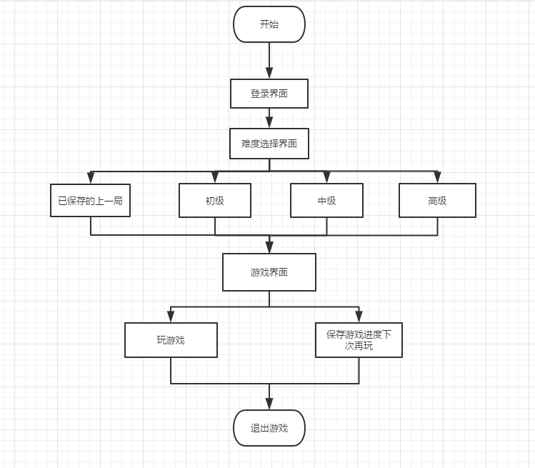

# 1、项目简介

* 采用java swing设计扫雷游戏软件，设计目标如下：

```
1. 扫雷游戏分为初级、中级和高级三个级别，初级模式9*9个方块中有10个雷、中级模式16*16个方块中有40个雷、高级模式16*30个方块中有99个雷，单击游戏菜单可以选择“开局”、“初级”、“中级”、“高级”或“退出”。
2. 选择级别后出现相应雷区，若不选择默认初级模式，用户使用鼠标左键单击雷区中任一方块开始计时。
3. 用户要揭开某个方块，单击它。若所揭方块下有雷，用户便输了这一局，若所揭方块下无雷，则显示一个数字，该数字代表方块的周围的8个方块中共有多少颗雷。 
4. 如果用户认为某个方块下埋着雷，右键单击该方块，方块将出现一个扫雷标记。用户每标记出一个扫雷标记（无论用户是否正确），程序将显示的剩余雷数减少一个。 
5. 准确地找出所有雷，将取得该局游戏的胜利。否则，将会弹出失败框。
```

* 代码地址：

* 开发环境：jdk8、IDEA
* 功能流程图：



* 代码组织形式：

  

# 2、设计思路与分析


# 3、系统设计与实现

## 3.1 模块设计


## 3.2 游戏效果图


# 4、其他

# 。


# 2、整体架构

功能--对应技术

* 扫雷游戏算法实现（流程图）
* GUI登录界面
* 项目地址：github地址（git）
* 


我们实习计划三个月分别安排在柜面，大堂，客户经理，每个月每个岗位需要上交总结报告，按照学习的业务和相应的总结反馈报告评绩效，我这个月有两个星期在外拓，我担心我的报告没有实质内容


# 3、项目模块

## 3.1 创建游戏窗口


## 3.2 添加游戏标题


## 3.3 添加状态栏


## 3.4 定义游戏数据结构


## 3.5 添加游戏按钮


## 3.6 埋雷


## 3.7 计算周边雷的数量


## 3.8 扫雷--打开方块


## 3.9 扫雷--实现空格自动打开


## 3.10 给所有方块加上背景色


## 3.11 扫雷--踩雷处理


## 3.12 扫雷--设置暴雷Banner


## 3.13 扫雷--暴雷提示框


## 3.14 判断胜利


## 3.15 添加状态栏数据


## 3.16添加计时器


## 3.17 重新开始游戏


## 3.18 游戏扩展思考


# 4、problem

## 4.1 Java Swing界面中文乱码问题

编译(build)的时候和运行的时候使用同样的字符集就可以了。我设置为“UTF-8”。具体作法如下：

File->Settings->Build...->Compiler，在VM options里添加：-Dfile.encoding=UTF-8（如果你不行，可以尝试设置为-Dfile.encoding=UTF-8）


## 4.2 打jar包并转为exe可执行文件

参考：https://blog.csdn.net/weixin_38310965/article/details/80392767

将image文件夹复制到exe同一文件夹下


png等格式图像转为ico：浏览器搜索**在线转换图标文件**即可。


1
<video id="video" controls=""src="image/exe文件.mp4" preload="none">


2
<iframe height=498 width=510 src="image/exe文件.mp4">
3
<video id="video" controls="" preload="none">
    <source id="mp4" src="image/exe文件.mp4" type="video/mp4">
</video>